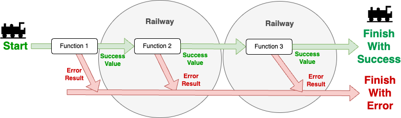
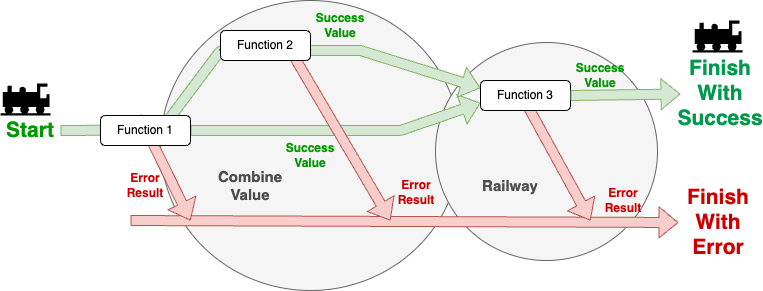

# SingleValueResults

C# Results Library that focus on Railway Oriented Programming.

# How can you install?

```sh
dotnet add package SingleValueResults
```

# Why Result type?

Some language, especially functional language has custom to use `Result` type, that express return type of the function
is either return value or Error.

There is of course pros and cons of result type.

**Pros**

- Readability and Explicit Error Handling.
- Slow "throw and catch" speed.
- Functional Style programming.
- Fully use of power of pattern matching.

**Cons**

- Not build in language feature.
- C# is not pure functional language.
- Complex for someone not used to.

This SingleValueResult try to be simple Result type, that fully use lately introduced pattern matching feature. And
first class support of the `Railway Oriented Programming` that introduced with Scott Wlaschin with following article.

[Railway Oriented Programming](https://fsharpforfunandprofit.com/rop/)

# Usage

1. Simple Function and Use Result Function
2. Don't use nullable value as Type of the Value
3. Wrapping throwing function that returns value.
4. Wrapping void function.
5. Railway Oriented Programming - Method Chain
6. Railway Oriented Programming - Async Task Functions.
7. Railway Oriented Programming - Combine Value
8. Railway Oriented Programming with Wrapping Function with Try.

## 1. Simple Function and Use Result Function

Basic use for this library is
use [SingleValueResult<T>](https://github.com/J-Tech-Japan/SingleValueResults/blob/main/src/SingleValueResults/SingleValueResults/ThreeValuesResult.cs)
for the return type of the functions.

Then you can return value when success, and when you have any issue, you can **return** exception. (not throw.)

Like example below, you can either return **Value itself** or **Exception**, and implicit operation can convert it
to `SingleValueResult<T>` class in code.

```csharp

internal class Program
{
    public static SingleValueResult<int> Increment(int target) => target switch
    {
        > 1000 => new ArgumentOutOfRangeException(nameof(target)),
        _ => target + 1
    };

    private static void Main(string[] args)
    {
        // use switch case to handle Result
        switch (Increment(100))
        {
            case { Exception: { } error }:
                Console.WriteLine($"Error: {error}");
                break;
            // This will return value result
            case { Value: { } value }:
                Console.WriteLine($"Value: {value}");
                break;
        }
        switch (Increment(1001))
        {
            // This will return exception result
            case { Exception: { } error } :
                Console.WriteLine($"Error: {error}");
                break;
            case { Value: { } value }:
                Console.WriteLine($"Value: {value}");
                break;
        }

        Console.WriteLine(RunIncrement(100));
        Console.WriteLine(RunIncrement(1001));
    }

    // use switch expression to handle Result
    private static string RunIncrement(int target) =>
        Increment(target) switch
        {
            { Exception: { } error } => $"Error: {error}",
            { Value: { } value } => $"Value: {value}",
            _ => "Unknown"
        };
}
```

**Notes**

`SingleValueResult<T>` does have `IsSuccess` property, which returns if it have error or not. But we recommend you to
use `Exception` property and `Value` property for the inspecting result. It is because of the C# feature of
the `pattern matching` can get exception or value without null checking and easily use after.

After `case { Exception: { } error } :`, error is sure of not null, because it checked with pattern matching.
After `case { Value: { } value }:`, value is not null, because it was checked not null with pattern matching as well.

## 2. Don't use nullable value as Type of the Value

C# has two different "nullable"
types. [Nullable Value Types](https://learn.microsoft.com/en-us/dotnet/csharp/language-reference/builtin-types/nullable-value-types)
and [Nullable Reference Types](https://learn.microsoft.com/en-us/dotnet/csharp/nullable-references).

`SingleValueResult<TValue>` has `where TValue: notnull` constraint. This is because if it allows null type, it will
allow Value is null and Exception is null Result class. notnull prevent to use both **Nullable Value Types** and *
*Nullable Reference Types**. But for the **Nullable Value Types** only show warnings because it is wrapped with *
*Nullable** generic type.

Many feature assume those value as irregular case and not working with it. How can you write value is null in some case?
you can
use [OptionalValue](https://github.com/J-Tech-Japan/SingleValueResults/blob/main/src/SingleValueResults/SingleValueResults/OptionalValue.cs)
type.

```csharp
internal class Program
{
    public static SingleValueResult<OptionalValue<string>> ConvertStringToHalfLength(string input)
        => input.Length switch
        {
            0 => new ApplicationException("Input string is empty"), // Exception
            1 => OptionalValue<string>.Empty, // Not error but Empty 
            _ => OptionalValue<string>.FromValue(input[..^(input.Length / 2)]) // has value 
        };

    private static void Main(string[] args)
    {
        if (args.Length == 0)
        {
            Console.WriteLine("Please input a string.");
            return;
        }
        var result = ConvertStringToHalfLength(args[0]);
        switch (result)
        {
            case { Exception: { } error }:
                Console.WriteLine("Exception: " + error.Message);
                break;
            case { Value : { HasValue: true } value }: // When OptionalValue has value
                Console.WriteLine("Value: " + value.Value);
                break;
            case { Value : { HasValue: false } }: // When OptionalValue is empty
                Console.WriteLine("No value");
                break;
        }
    }
}
```

## 3. Wrapping throwing function that returns value.

When I use `Result` type in C# project, often need in mixing with non-result functions which can be throw exception any
time. When this happens, we need to write try/catch and convert throwable functions to `Result`
type. `SingleValueResult` has `WrapTry` function to do this conversion.
When you use `WrapTry`, you need to pass `Func` as the argument.

```csharp

internal class Program
{
    public static int Divide(int numerator, int denominator) =>
        denominator == 0
            ? throw new ApplicationException("can not divide by 0")
            : numerator / denominator;

    private static void Main(string[] args)
    {
        // This will return exception result
        switch (SingleValueResult<int>.WrapTry(() => Divide(10, 0)))
        {
            case { Exception: { } error } :
                Console.WriteLine("Exception: " + error.Message);
                break;
            case { Value: { } value }:
                Console.WriteLine("Value: " + value);
                break;
        }

        // This will return value result
        switch (SingleValueResult<int>.WrapTry(() => Divide(10, 2)))
        {
            case { Exception: { } error } :
                Console.WriteLine("Exception: " + error.Message);
                break;
            case { Value: { } value }:
                Console.WriteLine("Value: " + value);
                break;
        }

    }
}
```

## 4. Wrapping void function.

When a function does not return value, C# can use void as a return (type). But you can not use `SingleValueResult<void>`
due to C# language definition. Instead, we
made [UnitValue](https://github.com/J-Tech-Japan/SingleValueResults/blob/main/src/SingleValueResults/SingleValueResults/UnitValue.cs)
type, which means nothing inside but as a data class.
UnitValue does not have any properties. You can wrap try with `WrapTry` void action, and it will
return `SingleValueResult<UnitValue>` type.

```csharp

internal class Program
{
    private static void Print(string message)
    {
        switch (message)
        {
            case not null when string.IsNullOrEmpty(message):
                throw new ApplicationException("message is empty");
                break;
            default:
                Console.WriteLine(message);
                break;
        }
    }

    private static void Main(string[] args)
    {
        // This will return value (UnitValue) result
        switch (SingleValueResult<UnitValue>.WrapTry(() => Print("Hello, World!")))
        {
            case { Exception: { } error } :
                Console.WriteLine("Exception: " + error.Message);
                break;
            case { Value: not null }:
                Console.WriteLine("No Exception");
                break;
        }

        // This will return exception result
        switch (SingleValueResult<UnitValue>.WrapTry(() => Print(string.Empty)))
        {
            case { Exception: { } error } :
                Console.WriteLine("Exception: " + error.Message);
                break;
            case { Value: not null }:
                Console.WriteLine("No Exception");
                break;
        }
    }
}
```

## 5. Railway Oriented Programming - Method Chain

Railway Oriented Programming (ROP) is a functional programming pattern that facilitates error handling and is often used
in languages that support functional programming concepts, like F#, Haskell, and others. The analogy of a railway is
used to describe the flow of data through a series of functions, similar to how a train travels along tracks.

SingleValueResults supports ROP by providing chain method to connect functions and simply write error handling code.



Like example below, you can use `Railway(nextFunction)` to method chain continuous functions.
If first method , in example `Increment` returns Exception, following functions `Double` and `Triple` will not executed,
it will be just passing Exception that returned by `Increment`.
If first method returns value, second method, in this case `Double` will be execute, and if all three method
succeed, `Main` method receive the result value.
If any methods returns Exception Result, it will return Exception to the `Main` function.

```csharp
class Program
{
    public static SingleValueResult<int> Increment(int target) => target switch
    {
        > 1000 => new ApplicationException($"{target} is not allowed for {nameof(Increment)}"),
        _ => target + 1
    };
    public static SingleValueResult<int> Double(int target) => target switch
    {
        > 1000 => new ApplicationException($"{target} is not allowed for {nameof(Double)}"),
        _ => target * 2
    };
    public static SingleValueResult<int> Triple(int target) => target switch
    {
        > 1000 => new ApplicationException($"{target} is not allowed for {nameof(Triple)}"),
        _ => target * 3
    };

    
    static void Main(string[] args)
    {
        // Error: System.ApplicationException: 1001 is not allowed for Increment
        switch (Increment(1001).Railway(Double).Railway(Triple))
        {
            case { Exception: { } error }:
                Console.WriteLine($"Error: {error}");
                break;
            case { Value: { } value }:
                Console.WriteLine($"Value: {value}");
                break;
        }
        
        // Error: System.ApplicationException: 1001 is not allowed for Double
        switch (Increment(1000).Railway(Double).Railway(Triple))
        {
            case { Exception: { } error }:
                Console.WriteLine($"Error: {error}");
                break;
            case { Value: { } value }:
                Console.WriteLine($"Value: {value}");
                break;
        }
        
        // Error: System.ApplicationException: 1202 is not allowed for Triple
        switch (Increment(600).Railway(Double).Railway(Triple))
        {
            case { Exception: { } error }:
                Console.WriteLine($"Error: {error}");
                break;
            case { Value: { } value }:
                Console.WriteLine($"Value: {value}");
                break;
        }
        
        // Value: 24
        switch (Increment(3).Railway(Double).Railway(Triple))
        {
            case { Exception: { } error }:
                Console.WriteLine($"Error: {error}");
                break;
            case { Value: { } value }:
                Console.WriteLine($"Value: {value}");
                break;
        }
    }
}
```

## 6. Railway Oriented Programming - Async Task Functions.

Async method returns `Task<SingleValueResult<TValue>>`, but we provide async chaining methods as well.

```csharp
class Program
{
    public static Task<SingleValueResult<int>> IncrementAsync(int target) =>
        Task.FromResult<SingleValueResult<int>>(target switch
            {
                > 1000 => new ApplicationException($"{target} is not allowed for {nameof(IncrementAsync)}"),
                _ => target + 1
            });
    public static Task<SingleValueResult<int>> DoubleAsync(int target) =>
        Task.FromResult<SingleValueResult<int>>(target switch
        {
            > 1000 => new ApplicationException($"{target} is not allowed for {nameof(DoubleAsync)}"),
            _ => target * 2
        });
    public static Task<SingleValueResult<int>> TripleAsync(int target) =>
        Task.FromResult<SingleValueResult<int>>(target switch
        {
            > 1000 => new ApplicationException($"{target} is not allowed for {nameof(TripleAsync)}"),
            _ => target * 3
        });

    static async Task Main(string[] args)
    {
        // Error: System.ApplicationException: 1001 is not allowed for IncrementAsync
        switch (await IncrementAsync(1001).Railway(DoubleAsync).Railway(TripleAsync))
        {
            case { Exception: { } error }:
                Console.WriteLine($"Error: {error}");
                break;
            case { Value: { } value }:
                Console.WriteLine($"Value: {value}");
                break;
        }
        // Error: System.ApplicationException: 1001 is not allowed for DoubleAsync
        switch (await IncrementAsync(1000).Railway(DoubleAsync).Railway(TripleAsync))
        {
            case { Exception: { } error }:
                Console.WriteLine($"Error: {error}");
                break;
            case { Value: { } value }:
                Console.WriteLine($"Value: {value}");
                break;
        }
        // Error: System.ApplicationException: 1202 is not allowed for TripleAsync
        switch (await IncrementAsync(600).Railway(DoubleAsync).Railway(TripleAsync))
        {
            case { Exception: { } error }:
                Console.WriteLine($"Error: {error}");
                break;
            case { Value: { } value }:
                Console.WriteLine($"Value: {value}");
                break;
        }
        // Value: 24
        switch (await IncrementAsync(3).Railway(DoubleAsync).Railway(TripleAsync))
        {
            case { Exception: { } error }:
                Console.WriteLine($"Error: {error}");
                break;
            case { Value: { } value }:
                Console.WriteLine($"Value: {value}");
                break;
        }
    }
}
```

You can mix async functions with non-async functions as well.

```csharp
 class Program
{
    public static SingleValueResult<int> Increment(int target) => target switch
    {
        > 1000 => new ApplicationException($"{target} is not allowed for {nameof(Increment)}"),
        _ => target + 1
    };
    public static SingleValueResult<int> Double(int target) => target switch
    {
        > 1000 => new ApplicationException($"{target} is not allowed for {nameof(Double)}"),
        _ => target * 2
    };
    public static SingleValueResult<int> Triple(int target) => target switch
    {
        > 1000 => new ApplicationException($"{target} is not allowed for {nameof(Triple)}"),
        _ => target * 3
    };
    
    public static Task<SingleValueResult<int>> IncrementAsync(int target) =>
        Task.FromResult<SingleValueResult<int>>(target switch
        {
            > 1000 => new ApplicationException($"{target} is not allowed for {nameof(IncrementAsync)}"),
            _ => target + 1
        });
    public static Task<SingleValueResult<int>> DoubleAsync(int target) =>
        Task.FromResult<SingleValueResult<int>>(target switch
        {
            > 1000 => new ApplicationException($"{target} is not allowed for {nameof(DoubleAsync)}"),
            _ => target * 2
        });
    public static Task<SingleValueResult<int>> TripleAsync(int target) =>
        Task.FromResult<SingleValueResult<int>>(target switch
        {
            > 1000 => new ApplicationException($"{target} is not allowed for {nameof(TripleAsync)}"),
            _ => target * 3
        });

    static async Task Main(string[] args)
    {
        // Error: System.ApplicationException: 1001 is not allowed for IncrementAsync
        switch (await Increment(1001).Railway(DoubleAsync).Railway(TripleAsync))
        {
            case { Exception: { } error }:
                Console.WriteLine($"Error: {error}");
                break;
            case { Value: { } value }:
                Console.WriteLine($"Value: {value}");
                break;
        }
        // Error: System.ApplicationException: 1001 is not allowed for DoubleAsync
        switch (await IncrementAsync(1000).Railway(Double).Railway(TripleAsync))
        {
            case { Exception: { } error }:
                Console.WriteLine($"Error: {error}");
                break;
            case { Value: { } value }:
                Console.WriteLine($"Value: {value}");
                break;
        }
        // Error: System.ApplicationException: 1202 is not allowed for TripleAsync
        switch (await IncrementAsync(600).Railway(DoubleAsync).Railway(Triple))
        {
            case { Exception: { } error }:
                Console.WriteLine($"Error: {error}");
                break;
            case { Value: { } value }:
                Console.WriteLine($"Value: {value}");
                break;
        }
        // Value: 24
        switch (await IncrementAsync(3).Railway(DoubleAsync).Railway(TripleAsync))
        {
            case { Exception: { } error }:
                Console.WriteLine($"Error: {error}");
                break;
            case { Value: { } value }:
                Console.WriteLine($"Value: {value}");
                break;
        }
    }
}
```

## 7. Railway Oriented Programming - Combine Value

We have cases that need to prepare 2 or more value and pass it to next function. One way to achieve this is, programmer
make a wrapping function and gather two value in function and use railway to handle results. But SingleValueResults
provide `CombineValue` methods, which follows first Result, run second function and instead of passing only last
executed value, but both first value and second value together and pass it to third function.



We
provide [TwoValuesResult](https://github.com/J-Tech-Japan/SingleValueResults/blob/main/src/SingleValueResults/SingleValueResults/TwoValuesResult.cs), [ThreeValuesResult](https://github.com/J-Tech-Japan/SingleValueResults/blob/main/src/SingleValueResults/SingleValueResults/ThreeValuesResult.cs), [FourValuesResult](https://github.com/J-Tech-Japan/SingleValueResults/blob/main/src/SingleValueResults/SingleValueResults/FourValuesResult.cs)
and [FiveValuesResult](https://github.com/J-Tech-Japan/SingleValueResults/blob/main/src/SingleValueResults/SingleValueResults/FiveValuesResult.cs)
so each time we use `CombineValue`, it stores last values and create new class.

We can do it with following code.

```csharp
internal class Program
{
    public static SingleValueResult<int> Increment(int target) => target switch
    {
        > 1000 => new ApplicationException(
            $"{target} can not use for the {nameof(Increment)}. It should be under or equal 1000"),
        _ => target + 1
    };
    public static SingleValueResult<int> Add(int target1, int target2) => target1 switch
    {
        > 100 => new ApplicationException($"over 100 is not allowed for {nameof(Add)}"),
        _ => target1 + target2
    };
    public static SingleValueResult<int> Divide(int numerator, int denominator) =>
        (numerator, denominator) switch
        {
            (_, 0) => new ApplicationException("can not divide by 0"),
            _ => numerator / denominator
        };

    private static void Main(string[] args)
    {
        // Pattern 1 : Use Railway2Combine static method
        // calculate answer = (23 + 1) / (2 + 4) = 4
        // Value1: 4
        switch (SingleValueResult<int>.Railway2Combine(
            Increment(23),
            Add(2, 4),
            Divide))
        {
            case { Exception: { } error }:
                Console.WriteLine("Exception1: " + error.Message);
                break;
            case { Value: var value }:
                Console.WriteLine("Value1: " + value);
                break;
        }

        // Pattern 2 : Use CombineValue method chain
        // calculate answer = (29 + 1) / (1 + 9) = 3
        // Value: 3
        switch (Increment(29)
            .CombineValue(Add(1, 9))
            .Railway(Divide))
        {
            case { Exception: { } error }:
                Console.WriteLine("Exception2: " + error.Message);
                break;
            case { Value: var value }:
                Console.WriteLine("Value2: " + value);
                break;
        }

        // Pattern 3 : Error in Increment method (target > 1000)
        // Exception3: 2000 can not use for the Increment. It should be under or equal 1000
        switch (Increment(2000)
            .CombineValue(Add(1, 9))
            .Railway(Divide))
        {
            case { Exception: { } error }:
                Console.WriteLine("Exception3: " + error.Message);
                break;
            case { Value: var value }:
                Console.WriteLine("Value3: " + value);
                break;
        }

        // Pattern 4 : Error in Add method (target1 > 100)
        // Exception4: over 100 is not allowed for Add
        switch (Increment(19)
            .CombineValue(Add(1000, 9))
            .Railway(Divide))
        {
            case { Exception: { } error }:
                Console.WriteLine("Exception4: " + error.Message);
                break;
            case { Value: var value }:
                Console.WriteLine("Value4: " + value);
                break;
        }

        // Pattern 5 : Error in Divide method (denominator <> 0)
        // Exception5: can not divide by 0
        switch (Increment(19)
            .CombineValue(Add(0, 0))
            .Railway(Divide))
        {
            case { Exception: { } error }:
                Console.WriteLine("Exception5: " + error.Message);
                break;
            case { Value: var value }:
                Console.WriteLine("Value5: " + value);
                break;
        }
    }
}
```

We can use `RailWay` and `CombineValue` Method in Async as well.

## 8. Railway Oriented Programming with Wrapping Function with Try.

Example above in **3. Wrapping throwing function that returns value.** can be use in the Railway Oriented Method Chain
as well.

```csharp
internal class Program
{
    public static SingleValueResult<int> Increment(int target) => target switch
    {
        > 1000 => new ApplicationException($"{target} is not allowed for {nameof(Increment)}"),
        _ => target + 1
    };
    public static int IncrementWithThrowing(int target) => target switch
    {
        > 1000 => throw new ApplicationException(
            $"{target} is not allowed for {nameof(Increment)}"),
        _ => target + 1
    };
    public static SingleValueResult<int> Double(int target) => target switch
    {
        > 1000 => new ApplicationException($"{target} is not allowed for {nameof(Double)}"),
        _ => target * 2
    };
    public static SingleValueResult<int> Triple(int target) => target switch
    {
        > 1000 => new ApplicationException($"{target} is not allowed for {nameof(Triple)}"),
        _ => target * 3
    };
    public static int TripleWithThrowing(int target) => target switch
    {
        > 1000 => throw new ApplicationException($"{target} is not allowed for {nameof(Triple)}"),
        _ => target * 3
    };

    private static void Main(string[] args)
    {
        // IncrementWithThrowing and TripleWithThrowing can throw exceptions
        // WrapTry is used to catch exceptions and return them as error
        // Calculate (1 + 1) * 2 * 3 = 12
        // Value1: 12
        switch (SingleValueResult<int>.WrapTry(() => IncrementWithThrowing(1))
            .Railway(Double)
            .RailwayWrapTry(TripleWithThrowing))
        {
            case { Exception: { } error1 }:
                Console.WriteLine($"Error1: {error1}");
                break;
            case { Value: { } value1 }:
                Console.WriteLine($"Value1: {value1}");
                break;
        }

        // IncrementWithThrowing and TripleWithThrowing can throw exceptions
        // WrapTry is used to catch exceptions and return them as error
        // Error2: System.ApplicationException: 2000 is not allowed for Increment
        switch (SingleValueResult<int>.WrapTry(() => IncrementWithThrowing(2000))
            .Railway(Double)
            .RailwayWrapTry(TripleWithThrowing))
        {
            case { Exception: { } error2 }:
                Console.WriteLine($"Error2: {error2}");
                break;
            case { Value: { } value2 }:
                Console.WriteLine($"Value2: {value2}");
                break;
        }

        // IncrementWithThrowing and TripleWithThrowing can throw exceptions
        // WrapTry is used to catch exceptions and return them as error
        // Error3: System.ApplicationException: 1001 is not allowed for Double
        switch (SingleValueResult<int>.WrapTry(() => IncrementWithThrowing(1000))
            .Railway(Double)
            .RailwayWrapTry(TripleWithThrowing))
        {
            case { Exception: { } error3 }:
                Console.WriteLine($"Error3: {error3}");
                break;
            case { Value: { } value3 }:
                Console.WriteLine($"Value3: {value3}");
                break;
        }
        
        // IncrementWithThrowing and TripleWithThrowing can throw exceptions
        // WrapTry is used to catch exceptions and return them as error
        // Error4: System.ApplicationException: 1202 is not allowed for Triple
        switch (SingleValueResult<int>.WrapTry(() => IncrementWithThrowing(600))
            .Railway(Double)
            .RailwayWrapTry(TripleWithThrowing))
        {
            case { Exception: { } error4 }:
                Console.WriteLine($"Error4: {error4}");
                break;
            case { Value: { } value4 }:
                Console.WriteLine($"Value4: {value4}");
                break;
        }
    }
}
```